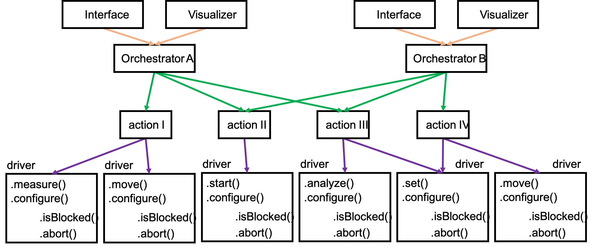

# getting started

## environment setup
- install miniconda[https://docs.conda.io/en/latest/miniconda.html], python 3 only
- clone git repository
- from repo directory, setup conda environment using `conda env create -f helao.yml`

## simulation servers
- galil and gamry server code current import from driver.*_simulate
- cd into server directory, execute start fastapi instances via  `python galil_server.py` and `python gamry_server.py`

## launch script
- `helao.py` script can validate server configuration parameters, launch a group of servers, and shutdown all servers beloning to a group
- server groups may be defined as .py files in the `config/` folder (see `config/world.py` as an example)
- launch syntax: `python helao.py world` will validate and launch servers with parameters defined in `config/world.py`, while also writing all monitored process IDs to `pids_world.pck` in the root directory
- exercise caution when running multiple server groups as there is currently no check for ports that are currently in-use between different config files

## design

