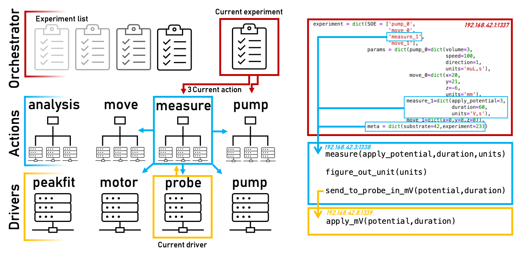

# HELAO public repository :robot: :rocket: :handshake: :woman_scientist: :man_scientist:
Helao deploys Hierachical Experimental Laboratory Automation and Orchestration
The idea behind this project is that we wanted to deploy active learning to different devices located in our laboratory and to others and even to many instruments running in parallel. To to this we utilized [fastAPI](https://fastapi.tiangolo.com/), a web framework that allows the facile developement of APIs.

## HELAO-pub repository

This branch is related to the code which was used for running closed-loop experimentation using the scanning droplet cell (SDC) at Karlsruhe Institute of Technology and Helmholtz Institute Ulm for studying fast-charging Si-Ge-Sn ternary anodes for Li-ion batteries. More detailes are in the upcoming publication.

## Abstract

Materials acceleration platforms (MAPs) operate on the paradigm of integrating combinatorial synthesis, high-throughput characterization, automatic analysis and machine learning. Within these MAPs one or multiple autonomous feedback loops aim to optimize materials for certain functional properties or generate new insights. Fundamentally, this necessitates accelerated, but foremost integrated, research actions. Herein, a web based asynchronous protocol to seamlessly integrate research tasks within a hierarchical experimental laboratory automation and orchestration (HELAO) framework is presented. We demonstrate the capability of orchestrating distributed research instruments that may incorporate data from experiments, simulations, and databases. HELAO offers interfacing laboratory hardware and software distributed across several computers and operating systems for executing an experiment, data analysis, provenance tracking, and autonomous planning. Research acceleration in terms of reduction of total experimental time is demonstrated to be close to 2x (in addition to the speedup of active learning of 5-10x depending on active learning metric) by deploying a centrally orchestrated fleet of instruments for a active learning. To the best of our knowledge, HELAO is the only laboratory automation framework with integrated data management capable of running closed loop optimization on multiple instruments and extreme modularity.

## TL;DR

If you want to build autonomous labs that are spread around the globe use this framework - it might save you a lot of stress.

## Getting started

We have implemented a series of drivers and analysis techniques which you can easily reuse if you have the same or similar hardware.
The implemented devices within the scope of this research  at KIT/HIU for the SDC are shown in the table below. This list is not complete, as the drivers and servers for other devices used at Caltech or at KIT/HIU for spectroscopy / another SDC devices are available in the `main` branch of this repository.

The used hardware for this branch is the following:
| **Device Name** | **Type**                      | **Communication**             | **Measures**     | **Manufacturer**          | **natively blocking** |
| --------------- | ----------------------------- | ----------------------------- | ---------------- | ------------------------- | --------------------- |
| lang            | Motion                        | .net API                      | position         | Lang GmbH                 | no                    |
| autolab         | Potentiostat                  | .net API                      | electrochemistry | Methrohm Autolab B.V.     | yes                   |
| hamilton        | pumping                       | TCP/IP                        | liquid volume    | Hamilton Company          | yes                   |
| force           | force sensing                 | serial commands               | force            | ME Meßsysteme GmbH        | n/a                   |
| kadi            | data management               | python package                | n.a.             | KIT                       | yes                   |
| aux             | machine learning and analysis | python package                | n.a.             | n.a.                      | yes                   |

There are dummy drivers and dummy analysis "devices" indicating how you can your own.

## Environment setup

HELAO is very lightweight and besides hardware drivers you just need a working python installation with fastAPI and starlette.
If you wish to setup thing super easy from scratch just follow these steps:
- install miniconda[https://docs.conda.io/en/latest/miniconda.html], python 3 only
- clone git repository
- from repo directory, setup conda environment using `conda env create -f helao.yml`

## Simulation servers
- galil and gamry server code current import from driver.*_simulate
- cd into server directory, execute start fastapi instances via  `python galil_server.py` and `python gamry_server.py`

## Launch script
- `helao.py` script can validate server configuration parameters, launch a group of servers, and shutdown all servers beloning to a group
- server groups may be defined as .py files in the `config/` folder (see `config/world.py` as an example)
- launch syntax: `python helao.py world` will validate and launch servers with parameters defined in `config/world.py`, while also writing all monitored process IDs to `pids_world.pck` in the root directory
- exercise caution when running multiple server groups as there is currently no check for ports that are currently in-use between different config files

Alternatively:
- `python testing\helao_interface.py world` syntax from root directory will launch a GUI with servers defined in `config/world.py`
- open all servers and driver servers required for the experimentation

## Design
High level layout of HELAO where experiments are executed by sequentially calling actions which are high level wrappers for other actions or low level driver instructions. Communication goes hierarchically down from the orchestrator level to actions, which may communicate with one another, to the lowest level of drivers which may only communicate with the calling action. The orchestrator, actions and drivers are all exposing python class functions through a web interface allowing for a modular and distributed hosting of each item. Experiments are dictionaries containing a sequence of events (SOE) that outlines in which the actions are to be executed. All actions require parameters and are supplied with experiment level metadata. Metadata may be introduced at any level.

## Acknowledgements

This project has received funding from the European Union’s [Horizon 2020 research and innovation programme](https://ec.europa.eu/programmes/horizon2020/en) under grant agreement [No 957189](https://cordis.europa.eu/project/id/957189).
